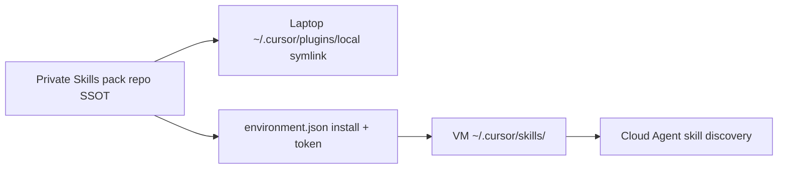

# Skills pack rebuild — fit against primary sources

**Date:** 2026-08-20  
**Question:** Is `docs/specs/skills-pack-rebuild/spec.md` (+ ADRs 0001–0005) the right approach for curated Cursor skills on Cloud Agents **without** Teams/Enterprise?  
**Sources used:** Cursor docs (`/docs/skills`, `/docs/plugins`, `/docs/reference/plugins`, `/docs/cloud-agent/setup`), Cursor staff on forum [#166008](https://forum.cursor.com/t/how-to-make-local-cursor-skills-available-for-use-in-cloud-agents-chat/166008) and [#165324](https://forum.cursor.com/t/shared-skills-on-cloud-agents/165324), this repo’s `install-on-cloud.sh`, [cursor/plugins `pstack`](https://github.com/cursor/plugins/blob/main/pstack/.cursor-plugin/plugin.json), [mattpocock/skills](https://github.com/mattpocock/skills) layout + ADR 0002. Secondary blogs excluded. Prior research note consulted as an index only; claims below re-checked against primaries.

---

## Verdict

**Right with fixes.**

The dual-wire architecture (repo SSOT → local `plugins/local` + Cloud `environment.json` install → VM `~/.cursor/skills/`) matches what Cursor staff and docs describe for personal plans. Do not invent Team Marketplace. Evolve this repo, not a new one. Before implement, fix **plugin skill-path discovery under category folders** and harden the install script’s wipe/copy behavior.

---

## 1. Does the proposed architecture match Cloud reality?

**Yes — for personal / non-Teams Cloud.**

| Spec / ADR claim | Primary evidence | Match? |
| --- | --- | --- |
| Laptop `~/.cursor/skills` does not appear on Cloud VMs | Staff (deanrie) [#166008](https://forum.cursor.com/t/how-to-make-local-cursor-skills-available-for-use-in-cloud-agents-chat/166008): Cloud Agents “don’t sync your laptop home directory”; global skills are local-only | Yes |
| IDE marketplace / User plugin install alone does not sync to Cloud | Plugins docs: Team Marketplace **Required** is the managed Cloud path ([plugins](https://cursor.com/docs/plugins)); staff [#165324](https://forum.cursor.com/t/shared-skills-on-cloud-agents/165324): no dashboard “roll out a skill” for individuals; Team Required is Teams/Enterprise | Yes |
| Cloud can load skills from VM `~/.cursor/skills/` | Skills discovery table: user-level `~/.cursor/skills/` ([skills](https://cursor.com/docs/skills)); staff [#166008]: “Cloud Agents read the VM’s `~/.cursor/skills/`” | Yes |
| Put files there via `.cursor/environment.json` `install` | Staff [#166008] (and follow-up): copy/generate skills in the install script so they work across repos without committing everywhere; setup docs: `install` runs during Builds, must be idempotent ([cloud-agent/setup](https://cursor.com/docs/cloud-agent/setup)) | Yes |
| Existing `install-on-cloud.sh` + `CURSOR_CLOUD_HOME_TOKEN` is that pattern | Script clones private `jadenmaciel/cursor-cloud-home` and `cp -a` into `$HOME/.cursor/skills/` | Yes (already implemented) |
| Local symlink → `~/.cursor/plugins/local/<name>` | Plugins docs: “Test plugins locally” + `ln -s … ~/.cursor/plugins/local/…` ([plugins](https://cursor.com/docs/plugins#test-plugins-locally)) | Yes |
| Asymmetric layouts (plugin local / flat-or-nested user skills on Cloud) | ADR-0005; staff never require Cloud to load `plugins/local` | Yes — intentional and sound |
| Avoid Teams/Enterprise Required plugins | Plugins: Team marketplaces are Teams/Enterprise ([plugins](https://cursor.com/docs/plugins#team-marketplaces)); staff [#165324] | Yes for the stated constraint |

**Staff’s four working Cloud paths** ([#166008](https://forum.cursor.com/t/how-to-make-local-cursor-skills-available-for-use-in-cloud-agents-chat/166008)):

1. Commit `.cursor/skills/` or `.agents/skills/` in the repo  
2. Install into VM `~/.cursor/skills/` via `environment.json` install  
3. Team Marketplace plugin **Required** (Teams/Enterprise)  
4. Agents API `skills` array (staff-attested; public API docs still thin)

The pack chooses **(2)** as the cross-repo personal path and **local plugin** for IDE UX. That is exactly the hybrid staff endorse when you refuse per-repo duplication and refuse Teams.

---

## 2. Contradictions: spec vs Cursor docs / staff

### No hard contradictions on Cloud delivery

- Spec ADR-0002 (“Cloud via environment install, not Teams”) aligns with staff [#166008] option 2 and rejects options 3–4 for this pass.  
- Spec ADR-0001 (repo SSOT, kill Mac→Git mirror) fixes the old README model (“SSOT on Mac”) which fought Cloud sync — consistent with isolation facts.  
- Spec ADR-0005 (asymmetric on-disk layout) matches the product: plugins load in IDE; Cloud discovery documented for skill dirs, not `plugins/local`.

### Soft / implement-time contradictions (must fix)

**A. Category folders vs Cursor Plugin discovery (material)**

- Spec / ADR-0003: mattpocock-style **category folders** under `skills/` + pstack-style `.cursor-plugin/plugin.json`.  
- [Skills docs](https://cursor.com/docs/skills): under project/user skill roots, Cursor **walks recursively**; category folders are organizational. So **Cloud** `cp` of `skills/category/name/SKILL.md` → `~/.cursor/skills/...` is fine if nested.  
- [Plugins reference](https://cursor.com/docs/reference/plugins): Skills discovery = “**Each subdirectory** containing a `SKILL.md`”; examples are flat `skills/code-reviewer/SKILL.md`. Manifest `"skills"` is a **string or array** of skill-directory path(s).  
- **pstack** uses flat `skills/<skill>/` + `"skills": "./skills/"` ([plugin.json](https://raw.githubusercontent.com/cursor/plugins/main/pstack/.cursor-plugin/plugin.json)).  
- **mattpocock** buckets under `skills/engineering|productivity|…` and ships a **Claude** plugin with an **array of explicit skill paths** because a single root path cannot curate buckets ([ADR 0002](https://github.com/mattpocock/skills/blob/master/.agents/adr/0002-ship-as-a-claude-code-plugin.md)). He has **no Cursor Cloud ADR**; Marketplace for Cursor is a separate open request.

**Implication:** Naively pointing Cursor `"skills": "./skills/"` at a **two-level** tree (`skills/<category>/<skill>/SKILL.md`) may discover **zero** skills locally (plugin loader looks one level down for `SKILL.md`, not recursively like user skill roots). Spec tasks already note “flatten or preserve — pick one”; that choice is not optional for local plugin UX.

**Fixes that stay primary-source-aligned:**

1. Prefer **flat** `skills/<skill>/` for the Cursor plugin (pstack shape); use README/CONTEXT categories only, **or**  
2. Keep categories and set `"skills"` to an **array of category dirs** (or each skill dir), matching the manifest schema’s `string | array`, **or**  
3. Preserve categories in git but **flatten** in `install-on-cloud.sh` for the VM (Cloud recursive discovery still works either way).

Do not assume “skills docs recursive walk” automatically applies to **plugin** component discovery without a local smoke test after symlink.

**B. Install script wipe vs multi-source VM skills**

Current `install-on-cloud.sh` does `rm -rf "$HOME/.cursor/skills"` then copies the pack. Staff say install into that dir; they do not require wiping the whole tree. If another install step or repo-committed skills also land under the same path, this is destructive. Spec testing (WARN on missing token; fixture safety) is right; implement should prefer replace-pack-owned names or a dedicated subdirectory only if discovery still finds nested `SKILL.md` (user skill roots recurse — yes per skills docs).

**C. `environment.json` has no skills field**

Spec does not claim a schema field; it uses `install`. Matches [cloud-agent/setup](https://cursor.com/docs/cloud-agent/setup) and environment schema practice (install script only). Good.

**D. Staff’s “easiest” path is still repo-committed skills**

[#166008](https://forum.cursor.com/t/how-to-make-local-cursor-skills-available-for-use-in-cloud-agents-chat/166008) lists commit-to-repo first. Spec outsources that for a **shared personal pack** via install — also staff-endorsed in the same thread’s follow-up (“avoid manually duplicating skills in every repo”). Not a contradiction; document that **each Cloud-enabled repo/environment must still invoke the install** (spec user story 20 / out-of-scope “rewrite every consumer” is honest).

**E. README lag**

Repo `README.md` still says “SSOT on Mac” while `CONTEXT.md` already describes the new model. Spec correctly plans README rewrite; not a docs/product contradiction.

---

## 3. Risks of merging five skills into one `/ship`

Product decision (ADR-0004), not blocked by Cursor platform docs. Risks:

| Risk | Why it matters | Mitigation already in spec / suggested |
| --- | --- | --- |
| **Context bloat** | One `SKILL.md` that folds gauntlet + review + thermos + address + green loads more tokens on every `/ship` than five skinny skills | Keep modes surgically gated; progressive `references/` per mode ([skills](https://cursor.com/docs/skills) progressive loading) |
| **Mode miss / wrong default** | Default `green` is heavy; users who typed `/gauntlet` may accidentally run full green | Modes required in description; description must say “use `/ship gauntlet` for verify-only” |
| **No aliases** | Spec deletes old names with no stubs — intentional muscle-memory break; dual discovery avoided | Accept; update always-on rules / AGENTS that still say `/gauntlet` |
| **Built-in overlap** | Cursor ships built-in `/review`, `/review-bugbot`, `/review-security`, `/babysit` ([skills](https://cursor.com/docs/skills)) | Name stays `/ship`; modes must not fight built-ins by claiming ownership of `/review` as a skill name |
| **Thermos / address agents** | Current laptop skills include `agents/` subtrees; mega-skill must preserve or re-home those paths | Explicitly migrate agent/helper files under `ship/` |
| **Discoverability** | Slash menu shows one skill; modes are argument-shaped | Description + README cheat sheet of five invocations |
| **Partial failure modes** | One buggy section can poison all five former entrypoints | Modes as separate sections / reference files; test inventory still asserts behaviors |

Net: merge is **coherent for a personal OS** if Ship is authored as a thin router + mode references, not a single wall of prose. Platform does not require five skills.

---

## 4. Evolve `cursor-cloud-home` vs new repo?

**Evolve in place (ADR-0001) — correct.**

Evidence:

- `install-on-cloud.sh` (and `install-clark-agency.sh`) hardcode `github.com/jadenmaciel/cursor-cloud-home.git` + `CURSOR_CLOUD_HOME_TOKEN`. A new repo forces secret + every consumer `environment.json` rewrite on day one.  
- Spec already owns the Cloud home token vocabulary and clone path.  
- Historical dump under `skills/` is acknowledged as something to slim, not a reason to abandon the remote name operators already wired.  
- New repo would only help if you wanted a clean public Marketplace identity; out of scope (private pack, no public Marketplace).

---

## 5. Shape comparison: pstack vs mattpocock vs this pack

| Dimension | pstack (cursor/plugins) | mattpocock/skills | Spec pack |
| --- | --- | --- | --- |
| Manifest | `.cursor-plugin/plugin.json` | `.claude-plugin/plugin.json` (Claude) | Cursor plugin (correct for Cursor IDE) |
| Skills layout | Flat under `skills/` | Bucketed categories | Hybrid — **needs fix A above** |
| Cloud story | Marketplace / Team (official plugin) | None first-party; `skills.sh` → project dirs | Private clone + VM `~/.cursor/skills/` |
| Local install | Marketplace or plugins/local | Claude marketplace / skills.sh | plugins/local symlink |

Borrow **Cursor plugin shell from pstack**; borrow **curation/categories mindset from mattpocock**, but wire categories the way Cursor’s **plugin** schema allows (`skills` array or flatten) — not Claude’s array-of-paths alone, and not “assume recursive plugin discovery.”

---

## Recommended fixes before / during implement

1. **Decide category strategy with a local plugin smoke test** after `ln -s` into `~/.cursor/plugins/local`: confirm `/ship` and keepers appear in Customize → Skills. Prefer flat tree or `"skills": ["./skills/<cat>/", …]`.  
2. **Adapt `install-on-cloud.sh`:** `SKILLS_PACK_SRC` override (tasks); nested copy; avoid blind full wipe if other writers share `~/.cursor/skills`; stay idempotent per [setup](https://cursor.com/docs/cloud-agent/setup#install-script-idempotency).  
3. **Ship skill:** folder name `ship`, frontmatter `name: ship` (must match parent folder — [skills](https://cursor.com/docs/skills)); modes in description; heavy mode bodies in `references/`.  
4. **Wire docs:** README snippet for consumer `environment.json` `install` calling the script + dashboard secret (already in scope).  
5. **Do not** rely on Team Marketplace, Agents API `skills` array, or laptop home sync for this pass.

---

## Answer checklist

1. **Architecture vs Cloud reality:** Matches staff + docs for personal plan (install → VM `~/.cursor/skills/` + local plugins/local).  
2. **Contradictions:** None on Cloud transport; **plugin discovery vs category nesting** is the main docs tension; install wipe and consumer wiring are operational risks.  
3. **`/ship` merge risks:** Context, muscle memory, mode routing, built-in overlap — manageable; not a platform veto.  
4. **Evolve vs new repo:** Evolve `cursor-cloud-home`.  
5. **Verdict:** **Right with fixes** (category/plugin path + install hardening + Ship authorship discipline).

---

## Primary source index

- [Agent Skills](https://cursor.com/docs/skills) — discovery paths, nested project/user skills, frontmatter `name` = folder  
- [Plugins](https://cursor.com/docs/plugins) — Team marketplaces, `~/.cursor/plugins/local`, Required mode  
- [Plugins reference](https://cursor.com/docs/reference/plugins) — skills discovery “each subdirectory”, `skills` string|array  
- [Cloud Agent setup](https://cursor.com/docs/cloud-agent/setup) — `install` script, idempotency, secrets  
- Forum staff [#166008](https://forum.cursor.com/t/how-to-make-local-cursor-skills-available-for-use-in-cloud-agents-chat/166008), [#165324](https://forum.cursor.com/t/shared-skills-on-cloud-agents/165324)  
- Repo: `install-on-cloud.sh`, ADRs 0001–0005, `docs/specs/skills-pack-rebuild/spec.md`  
- [pstack plugin.json](https://raw.githubusercontent.com/cursor/plugins/main/pstack/.cursor-plugin/plugin.json)  
- [mattpocock ADR 0002](https://github.com/mattpocock/skills/blob/master/.agents/adr/0002-ship-as-a-claude-code-plugin.md)
